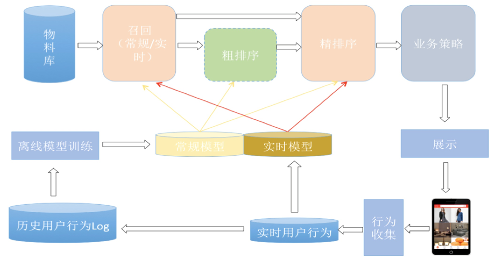

# 推荐系统

学习笔记

## 工业级推荐系统架构图

## 模块构成

* 召回
    * 作用:采取简单模型将推荐物品候选集合快速筛减到`千级别`甚至`百级别`
    * 目标:`快 + 全`, 用简单模型 + 少量特征，保证`泛化能力`, 尽量让用户感兴趣的物品在这个阶段能够找回来
    * 多路召回(至少7,8路):Tag，Topic，Entity，协同过滤，热门，相同地域等
* 排序
    * 目标:`精准`, 复杂模型 + 大量特征
* 后续业务
    * 重排序
    * 多样性
    * 用户体验

## 可探索方向

* 多路召回的数量超参K设置:不同用户对于每一路内容感兴趣程度不同,可以个性化配置
* 单路召回单模型单阶段推荐
* 适合推荐自身的DNN排序模型:如用Transformer做CTR排序模型

## 名词解释

* 实时：用户刷了一条微博，或者互动了一条微博，立刻就在刷出下一条微博的时候，体现出用户刚才这个行为（召回和排序都可以更改为实时模型）

## 参考

* [1] 知乎: [推荐系统召回四模型之：全能的FM模型](https://zhuanlan.zhihu.com/p/58160982)