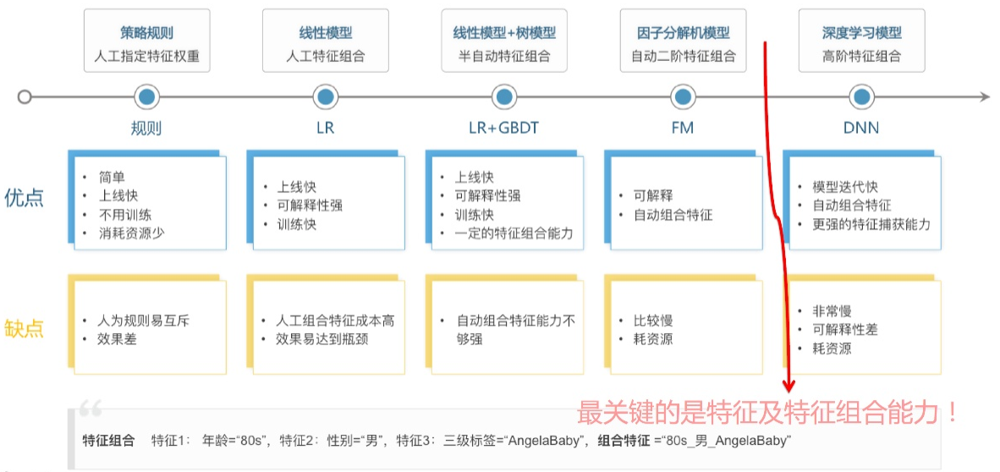
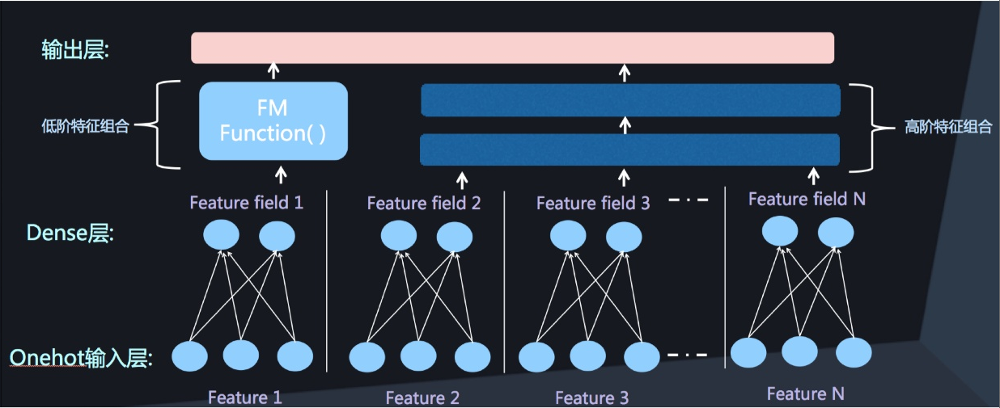
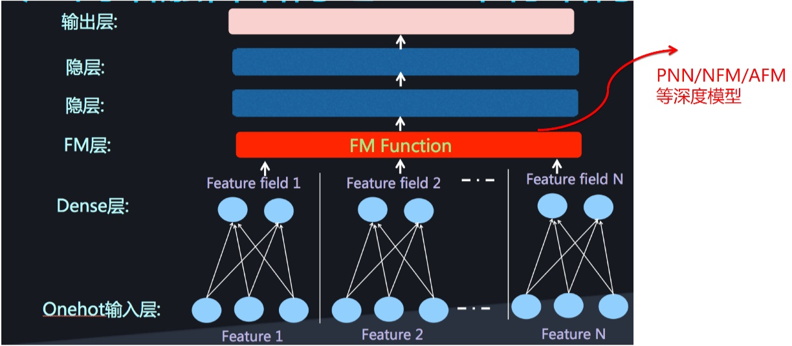
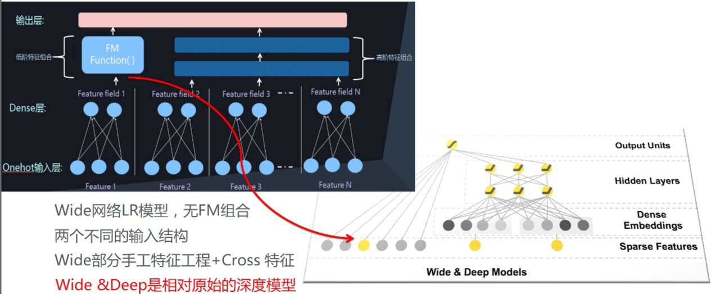
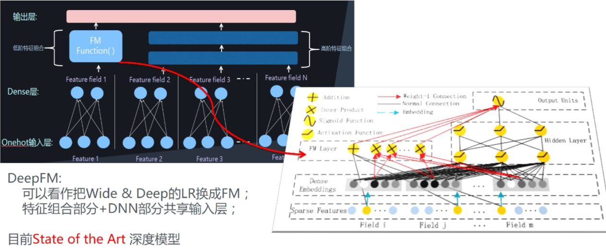
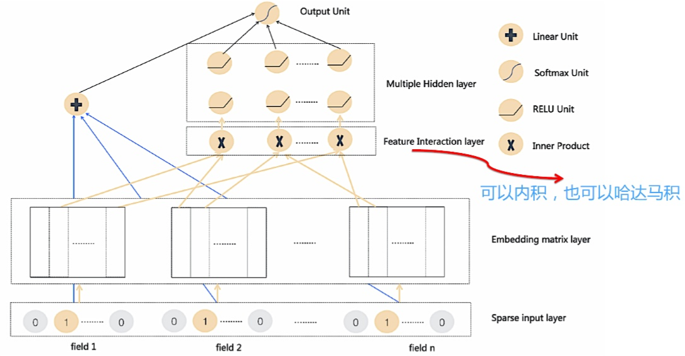
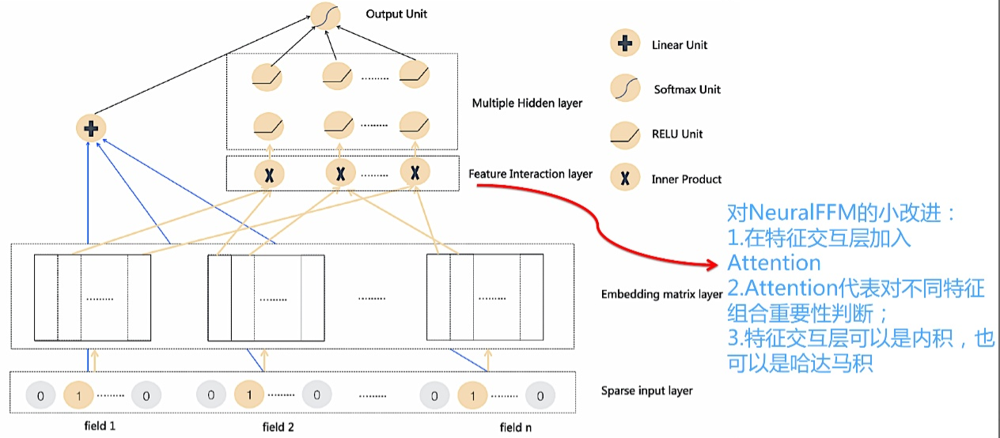
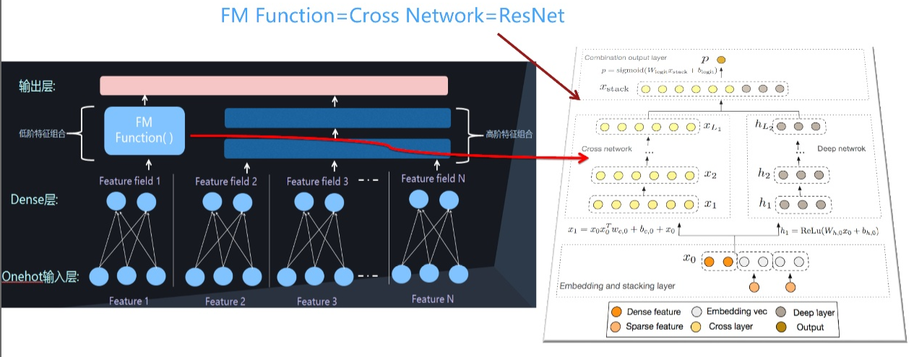
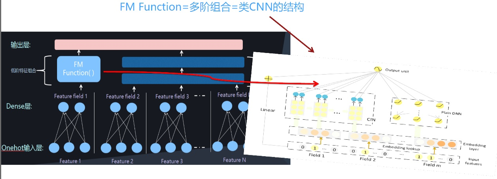

# 排序

## 工业界排序模型演进图

* CTR模型的核心就是`有效特征的选择，以及有效的特征组合的发现和利用; 特征组合自动化，更高阶的特征怎么融合进去, 是CTR模型进化的总体方向`

## 线性排序模型

* 演化路线：$ LR \rightarrow FM \rightarrow FFM \rightarrow 双线性FFM $

### 双线性FFM(Bilinear-FFM，减少内存)

* 对FFM模型的改进，使得性能优于或接近FFM，参数数量是FFM的2.6%
* 核心思想：$ v_i W v_j, 其中v_i, v_j和FM一样 $
* 3种共享参数矩阵W：
    * 所有Field共用一个W（参数 $ k \cdot k $）
    * 每个Field共用一个W（参数 $ F \cdot k \cdot k $）
    * 每两个Field组合共用一个W （参数 $ F \cdot F \cdot k \cdot k $）(效果最好)
* 还可以加入Layer Norm
* `很多大规模数据集合里，AUC能升一个点就是非常显著的一个增加`

## 深度排序模型

* 分类
    * FM Function并行

    * FM Function串行

* 演化路线：
    * Wide&Deep为起点：
        * $ W \& D \rightarrow DeepFM \rightarrow NeuralFFM \rightarrow DeepFFM $
        * `如何设计一个新的FM Function结构，来更有效地捕获二阶特征组合`
    * Deep & Cross为起点：
        * $ DeepCross \rightarrow xDeepFM $
        * `显式地对二阶、三阶、四阶...K阶特征组合建模`
* 输入问题基本解决：one-hot和embedding做映射
* `核心是二阶特征组合怎么设计网络结构`
* `对CTR捕获二、三、四阶都有正向收益，再捕获五阶以上就没什么用了`
* MLP对加性捕获特征的能里不强，但对乘性结构捕获特征合适，DL的发展趋势是`多模态`,但需要较强的工程能力
        

### Wide&Deep为起点

#### Wide & Deep

* 较为古老的深度模型
* 左侧用LR作为FM Function（LR存在的问题Wide & Deep也存在,LR侧特征组合需要手工设计）, 右侧是DNN

#### DeepFM

* 目前效果最好的基准模型之一,完备的深度CTR模型,删减或增加构建都没必要
* 再W&D得基础上，FM Function由LR换成了FM，能`自动做特征组合`

#### DeepFFM（NeuralFFM改进版）

* 将FFM模型改成DNN版本
* 哈达马积：向量对应位相乘，不加和，得到的还是向量
* NeuralFFM：deepFM里每个特征对应一个Embedding, FFM直接改成每个特征对应F个Embedding即可

* DeepFFM：在特征交互层加入Attention,因为两两特征组合里有的组合特征比较重要，有的没那么重要

* DeepFFM交互层的三种Attention方式：
    * 内积得到的值 + Attention + LayerNorm
    * 哈达马积得到的向量作为整体 + Attention + LayerNorm（best）
    * 哈达马积得到的向量值拆开 + Attention + LayerNorm
* `xDeepFM在基准方法里效果最好，DeepFFM还要更好`

### Deep & Cross为起点

#### Deep & Cross

* 显式地做高阶特征组合:设计几层神经网络结构，每一层代表其不同阶的组合，最下面是二阶组合，再套一层，三阶组合，四阶组合，一层一层往上套

#### xDeepFM

* 用类CNN的方式把二阶、三阶、四阶组合一层一层做出来
* 模型太复杂，真正部署上线成本比较高，不是优选方案

## 参考

* 知乎：[FFM及DeepFFM模型在推荐系统的探索](https://zhuanlan.zhihu.com/p/67795161)